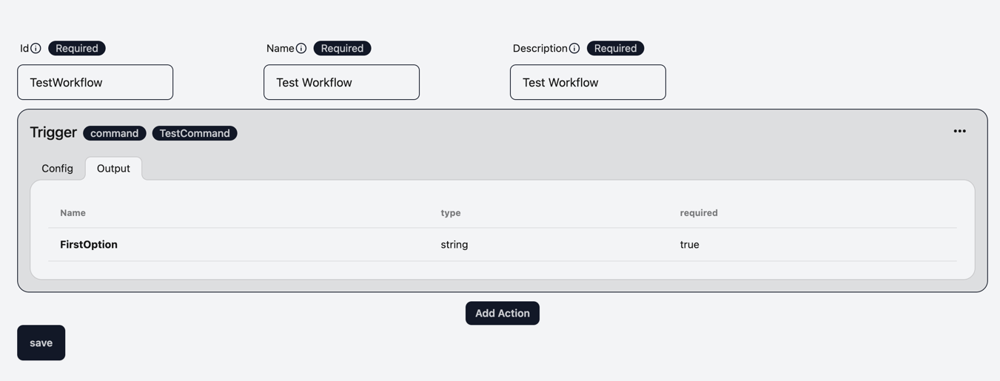

# Install Extension

Click [here](https://chromewebstore.google.com/detail/typee-a-browser-command-l/agifbaonnnpmdpnemfhddffdledhhnen) to
install the extension from Chrome Web Store.

# Grant Permissions

Open [Permissions page](chrome-extension://agifbaonnnpmdpnemfhddffdledhhnen/settings-ui/index.html#/permissions) to
grant permissions to the extension.

# Run a command

Open any url and type `Control + J` to open the command line.

There already are some built-in commands available.

# Install commands and workflows from templates

Open [Templates page](chrome-extension://agifbaonnnpmdpnemfhddffdledhhnen/settings-ui/index.html#/templates). There are
some built-in templates available.
You can install them by clicking the `Install` button. Or preview them by clicking the `Preview` button.
In preview page, you can see the details of the templates

# Create a command

Open [Commands page](chrome-extension://agifbaonnnpmdpnemfhddffdledhhnen/settings-ui/index.html#/commands). Click
the `Add Command` button and choose via UI to create a new command.

All fields are intuitive and easy to understand except `Type` field of Option.

`Type` field is to define the auto-completion behavior of the option. No matter what you choose, you can type anything
in an option.

Currently, there are 7 types available for Option. The meaning is easy to understand but the value passing to workflow
doesn't show on the UI.

| Type      | Description                                | Value                                   |
|-----------|--------------------------------------------|-----------------------------------------|
| string    | you can define choices for auto completion | Value of a choice                       |
| Tabs      | show current tab names                     | tabId of the chosen tab name            |
| TabGroups | show current tab group names               | tabGroupId of the chosen tab group name |
| Window    | show current window names                  | windowId of the chosen window name      |
| Bookmarks | show current bookmark names                | url of the chosen bookmark name         |
| History   | show current history names                 | url of the chosen history name          |
| Storage   | storage will show keys inside the storage  | same to the key name                    |

# Create a workflow

We will create a workflow that create a new tab and group it.

Open [Workflows page](chrome-extension://agifbaonnnpmdpnemfhddffdledhhnen/settings-ui/index.html#/workflows). Click
the `Add Workflow` button and choose via UI to create a new workflow.

Click `Select Trigger` button to choose a trigger for the workflow. Currently, there is only one trigger type, command,
available.

You can choose `TestCommand` we created before. After choosing the trigger, You can click `Output` tab inside the
trigger.
It shows what options/values are passed from the trigger and if they are `required` which means 100% present.

Then, click `Select Action` button to choose an action for the workflow.

We are going to choose `Tab` -> `create` action first.

After choosing the action, you can click `Output` tab inside the action.
The Output of the tab create action is `tabId` which is the id of the created tab.

Then, click `Select Action` button again to choose `tab` -> `group` action for the workflow.
We will put the `tabIds` parameter with `$createTab.tabId` which is the output of the previous action.
`$` means passing the output of the previous action. `createTab` is the name of the previous action. `tabId` is the
output of the previous action.

After choosing the action, you can click `Output` tab inside the action.
The Output of the tab group action is `groupId` which is the id of the created tab group.

Then, click `Select Action` button again to choose `group` -> `update` action for the workflow.

We will put the `tabGroupId` parameter with `$groupTheTab.groupId` which is the output of the previous action.
`$` means passing the output of the previous action. `groupTab` is the name of the previous action. `groupId` is the
output of the previous action.

And we will put the `title` parameter with `{{trigger.FirstOption}}` which is the value of the `FirstOption` of the
command.

`{{}}` is a [LiquidJS](https://liquidjs.com/) template syntax. You can use and process the value of previous actions or triggers.

The difference between `$`
and `{{}}` is `$` passes the output of the previous action no matter what type of output. It could string, number,
array, object. `{{}}` will parse the value and convert it to string, But `{{}}` can process the input with [filter](https://liquidjs.com/filters/overview.html).

You can also have logic with ``. Please check [liquidjs tag](https://liquidjs.com/tags/overview.html)

Because the liquidjs is template engine without eval of javascript. We can use it safely. 

Now, you can click the `Save` button to save the workflow.

# Run the workflow

Open any url and type `Control + J` to open the command line. 
Type `TestCommand` and fill out the options. Then press `Enter`.

